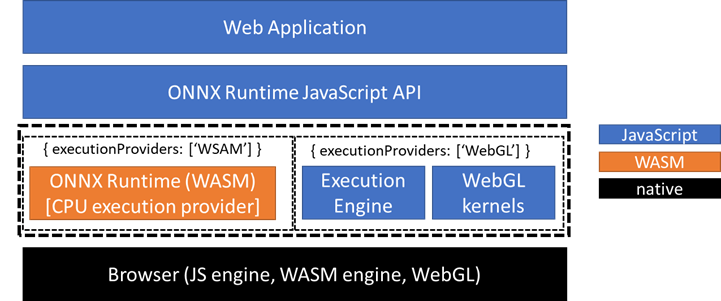
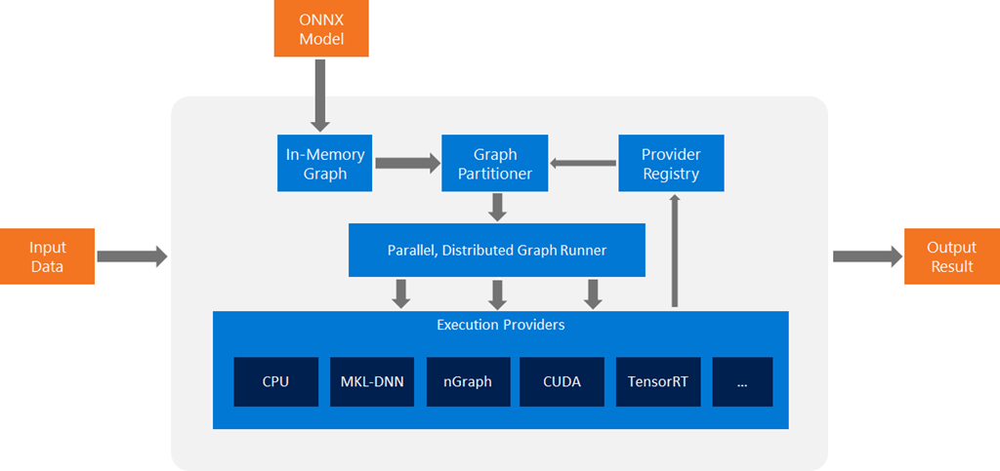

---
# You can also start simply with 'default'
theme: seriph
# random image from a curated Unsplash collection by Anthony
# like them? see https://unsplash.com/collections/94734566/slidev
background: images/main.jpg
# some information about your slides (markdown enabled)
title: Introduction to ONNX
info: |
  ## ONNX talk in a corporate company

# apply unocss classes to the current slide
class: text-center
# https://sli.dev/features/drawing
drawings:
  persist: false
# slide transition: https://sli.dev/guide/animations.html#slide-transitions
transition: slide-left
# enable MDC Syntax: https://sli.dev/features/mdc
mdc: true
---

# Introduction to ONNX

Presented by Bhasker Raju

<!-- <div class="pt-12">
  <span @click="$slidev.nav.next" class="px-2 py-1 rounded cursor-pointer" hover="bg-white bg-opacity-10">
    Press Space for next page <carbon:arrow-right class="inline"/>
  </span>
</div> -->

<div class="abs-br m-6 flex gap-2">
  <!-- <button @click="$slidev.nav.openInEditor()" title="Open in Editor" class="text-xl slidev-icon-btn opacity-50 !border-none !hover:text-white">
    <carbon:edit />
  </button> -->
  <a href="https://github.com/saibhaskerraju/onnx-public" target="_blank" alt="GitHub" title="Open in GitHub"
    class="text-xl slidev-icon-btn opacity-50 !border-none !hover:text-white">
    <carbon-logo-github />
  </a>
</div>

<!--
Hello everyone, welcome to `The talk on ONNX`.
-->

---
transition: fade-out
---

# Agenda

What you will be learning today

- 📝 **Concept** - What and why we need ONNX
- 🧑‍💻 **ONNX Runtime** - Is ONNX framework agnostic ?
- 🤹 **Interaction** - where can we use ONNX?
- 🎥 **Demo** - Demo a python model in VS Code
- 🎥 **Demo** - Demo a GenAI model in browser
- 🛠 **Architecture** - which technology powers ONNX

<br>
<br>

<!--
You can have `style` tag in markdown to override the style for the current page.
Learn more: https://sli.dev/features/slide-scope-style
-->

<style>
h1 {
  background-color: #2B90B6;
  background-image: linear-gradient(45deg, #4EC5D4 10%, #146b8c 20%);
  background-size: 100%;
  -webkit-background-clip: text;
  -moz-background-clip: text;
  -webkit-text-fill-color: transparent;
  -moz-text-fill-color: transparent;
}
</style>

<!--
By the end of this presentation you will be learning these concepts not necessarily in order but the important fundamental questions will get answered to help you get started with ONNX in your projects.
-->

---
transition: slide-up
level: 2
layout: image-right
image: ./images/frameworks.png
backgroundSize: contain
---

# Pre-ONNX era

- Multiple frameworks from multiple vendors
- Diverse base Technology and Huge learning curve
- No strong developer community or support ( except python )
- No cross compatibility between frameworks though written in same language.
- Difficult to collaborate multiple frameworks together. ex dotnet + python + cloud

<!--
Pre-onnx era , we had or we still have many frmaeworks from multiple vendors. Microsoft had ML.NET obviously designed for dotnet developers, Google has tensorflow for python developers and so on. lets focus on dotnet, lets say you want to start a ML project in dotnet, before choosing any framework besides understanding the framework , what do you look for? you look for support packages, developer community , range of projects it is capable to built and most importantly execution speed.

second, lets say someone wrote a package or model in pytorch and you are working on tensorflow. now, both are in python but in order to not re-invent the wheel, you wanted to consume the pytorch model in tensorflow but due to framework or syntax restrictions , you couldn't re-use and were forced to re-write.

third, a dept like ours, we had to force ourself to learn python and related frameworks to complete the project. This was a pain for a developer switching contexts and mastering various frameworks to get the job done. Lets take a look at what happened after ONNX came into market. 
-->

---
transition: slide-down
level: 2
layout: image-left
image: ./images/onnx.png
backgroundSize: contain
---

# The ONNX era

- Not a development framework but a universal ML format and has a runtime.
- Developed by `Microsoft` , `Facebook` and other developers.
- Doesnt matter in which framework or language a ML model is developed. You can convert to ONNX and use it.
- Runtime offers native execution speeds and interoperability.
- can run on any device and OS ( linux, mac, windows, android, ios, raspberry, IoT etc)
- On-Device Training ( advanced onnx feature)

<!--
Welcome to onnx-era , firstly, ONNX is NOT a ML development framework, its a open format and has a runtime. if you use ONNX runtime, you can use a model that is developed in tensorflow in python and consume it in dotnet at native execution speed.

lets take the same example we talked earlier. our dept is developing a ML soluton and we would like to stick to dotnet for designing and development. In order to achieve the final product, you realised that part 1 and part 4 of a 6-part development is already developed in python by industry experts and open-sourced. if not for ONNX, we probably would be switching to python whereever needed and might come up ways to integrate with dotnet and azure. This is a pain during development, deployment and debugging. We faced this in this dept before merger and i was one of the developer.

with ONNX runtime, you can convert the industry desinged open-source python model or any language models to ONNX format and consume directly in our dotnet code eliminating the need for other frameworks learning curve, re-using state-of-the-art models and not re-inventing the wheel and focusing on our core development process. we will understand this with a demo soon.
-->

--- 
transition: slide-up
level: 3
layout: image-right
image: ./images/two.jpg
backgroundSize: contain
---

# Demo

ONNX runtime in VS Code

- Create a Linear regression (`y =mx+c`) in python using `pytorch` framework
- convert the model into `ONNX` format
- create a dotnet `console` app and import the `onnx` model into it.
- supply the input and get a prediction.
- import the same `onnx` model into `react` application to run in-browser.
- supply the value and get a prediction.

<!--
https://huggingface.co/spaces/MaziyarPanahi/Phi-3.5-Vision 
https://github.com/microsoft/onnxruntime-inference-examples/tree/main/js/chat 
-->

---
class: px-20
---

# ONNX Architecture

Below is the architecture for browser and non-browsers

<div grid="~ cols-2 gap-2" m="t-2">

```yaml
---
Browser
---
```

```yaml
---
Non-Browser
---
```





</div>
<!--
Before you think too much , allow me to make you happy by saying you need not know this for development. this is just for the sake of getting a feel of internal working.
since browsers understand JS only, onnx models are converted using `wasm`. the webassembly module runs in the browsers JS engine allowing the ML model to be executed in client-side without any support. For non-browser, it uses the providers ( CPU, GPU etc).

-->

---
layout: center
class: text-center
---

# Learn More

[Documentation](https://onnxruntime.ai/) · [GitHub](https://github.com/saibhaskerraju/onnx-public) . [Phi 3.5 Vision](https://huggingface.co/spaces/MaziyarPanahi/Phi-3.5-Vision) .[Phi3-Onnx](https://github.com/microsoft/onnxruntime-inference-examples/tree/main/js/chat)
